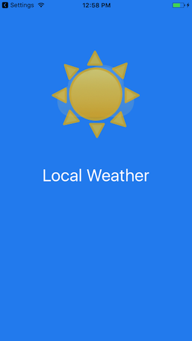
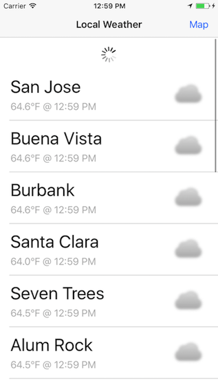
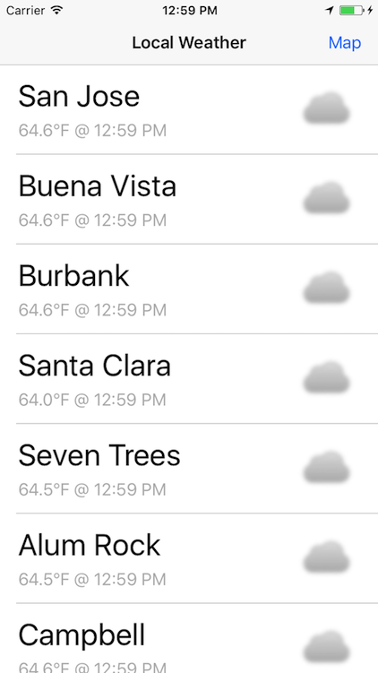
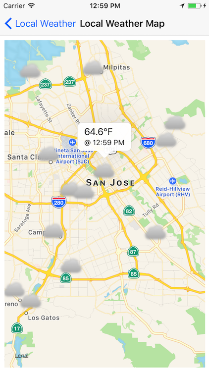
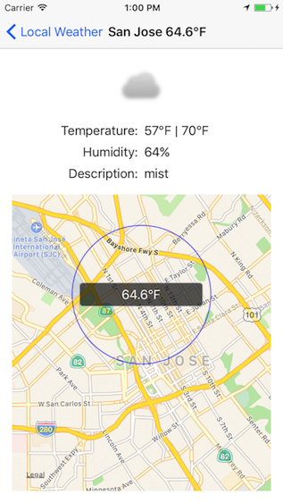

Local Weather
===========

Sample Objective-C app that displays location based weather. Leverages [LocalWeatherKit](https://github.com/AnthonyArzola/LocalWeatherKit "LocalWeatherKit on GitHub") CocoaPod. Additionally, makes use of [Local Weather images](https://github.com/AnthonyArzola/LocalWeatherImages "Local Weather Images on GitHub").

## Getting Started

1. Get API key from [OpenWeatherMap](https://openweathermap.org/appid)

2. Clone this repo

3. Open workspace, replace `KEY_ID` constant value in LWConstants.h with your API key

4. Clone [LocalWeatherKit](https://github.com/AnthonyArzola/LocalWeatherKit "LocalWeatherKit on GitHub"). LocalWeather app references LocalWeatherKit CocoaPod, which is local and unpublished pod.

5. That's it! Run app and enjoy the local weather. Well, the weather app at least.

## Leverages

* Core Location - CLLocationManager
* MapKit - MKAnnotation
* UIKit
  * Peek and Pop
   * UIApplicationShortcutItem
   * UIViewControllerPreviewingDelegate
   * UIPreviewActionItem

## App Screenshots

 

 
