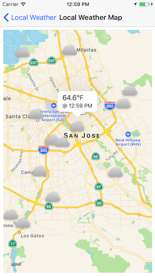

Local Weather
===========

Sample iOS app that displays location based weather. Leverages [LocalWeatherKit](https://github.com/AnthonyArzola/LocalWeatherKit "LocalWeatherKit on GitHub") CocoaPod. Additionally, makes use of [Local Weather images](https://github.com/AnthonyArzola/LocalWeatherImages "Local Weather Images on GitHub").

## Getting Started

1. Get OpenWeatherMap API key (https://openweathermap.org/appid)

2. Clone repo

3. Open LWConstants.h and set KEY_ID value from step 1.

4. That's it. Build, run app and enjoy the local weather. Well, the weather app at least.

## App Screenshots

